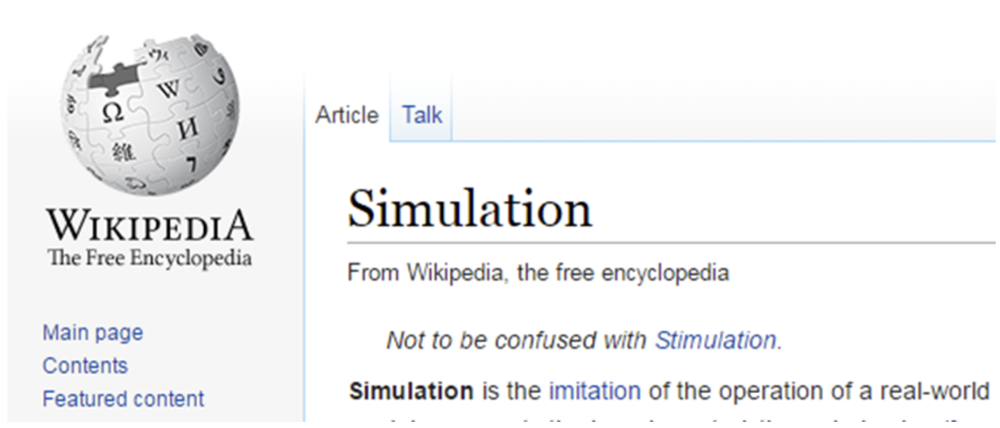
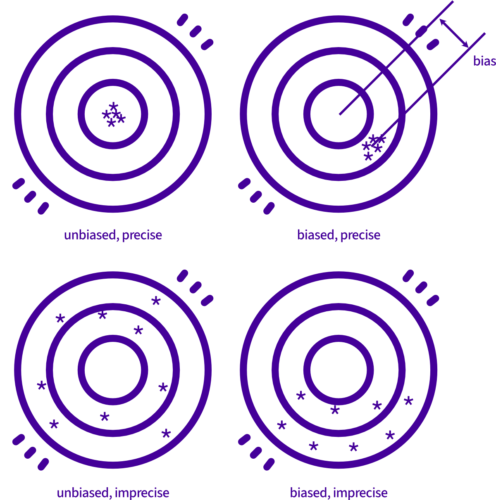
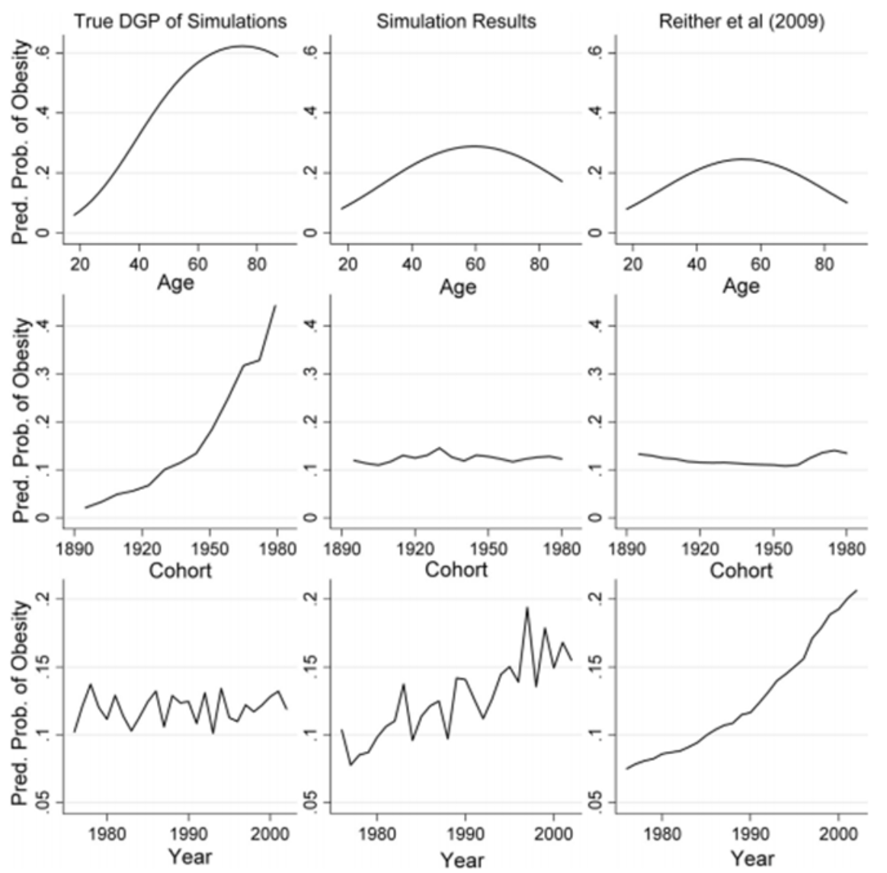
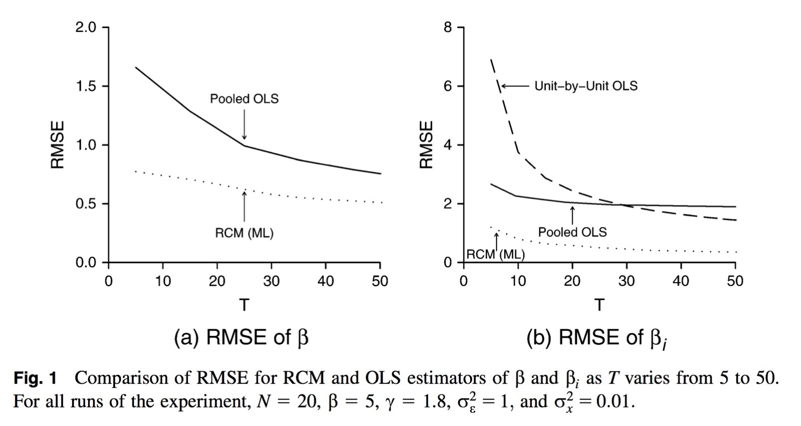
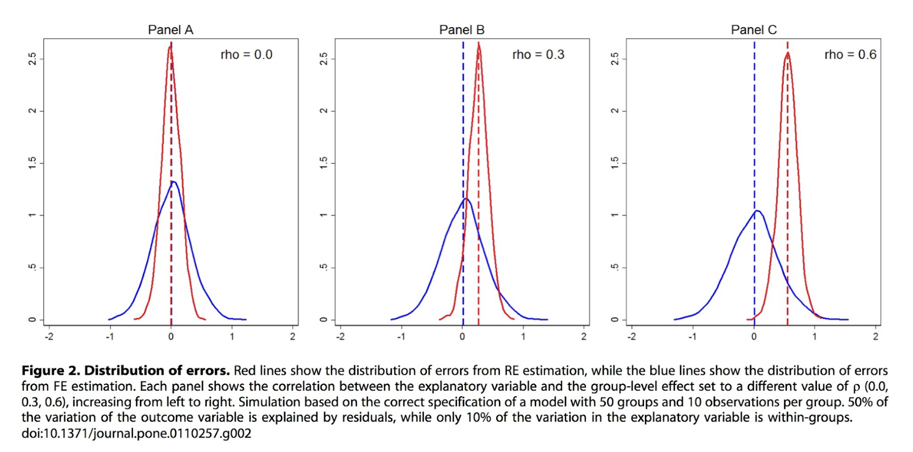
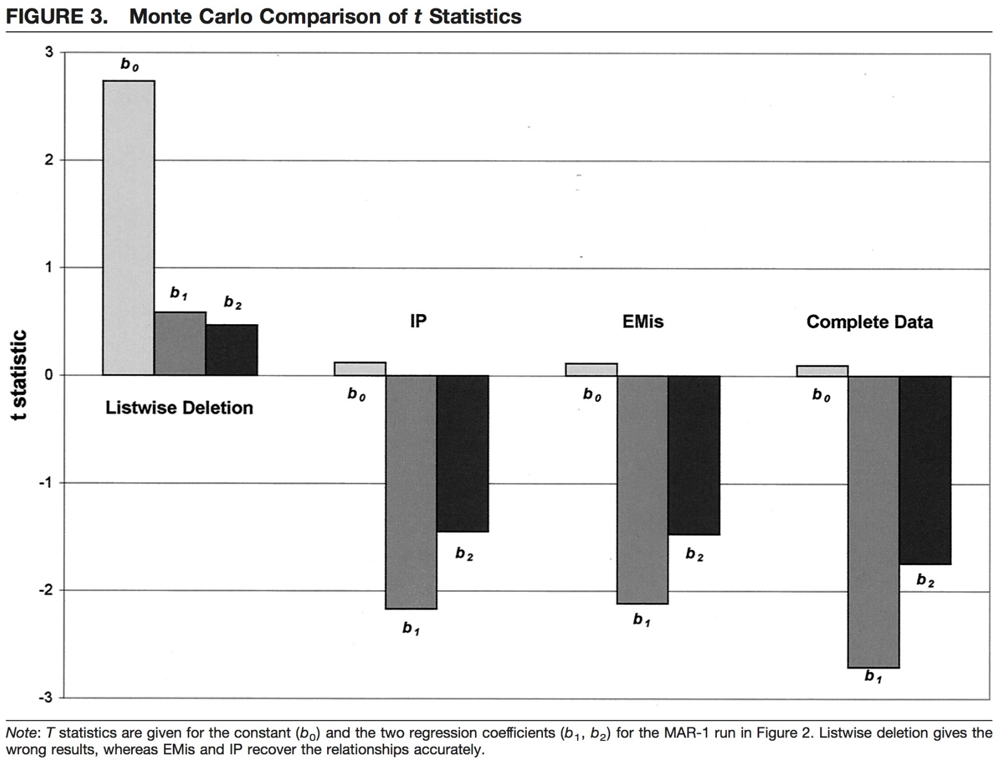
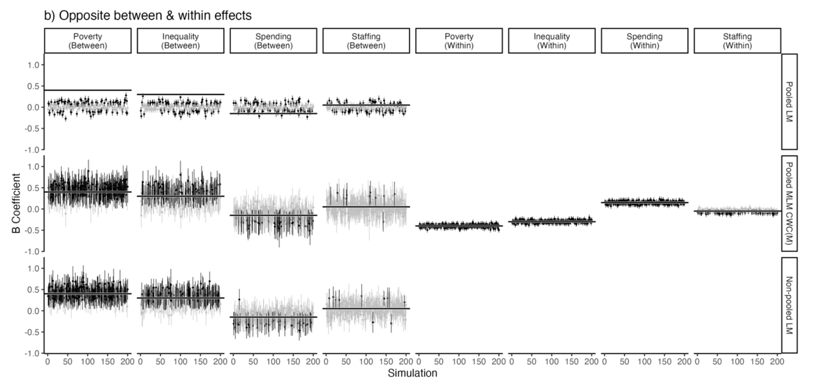
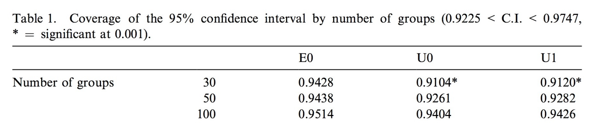
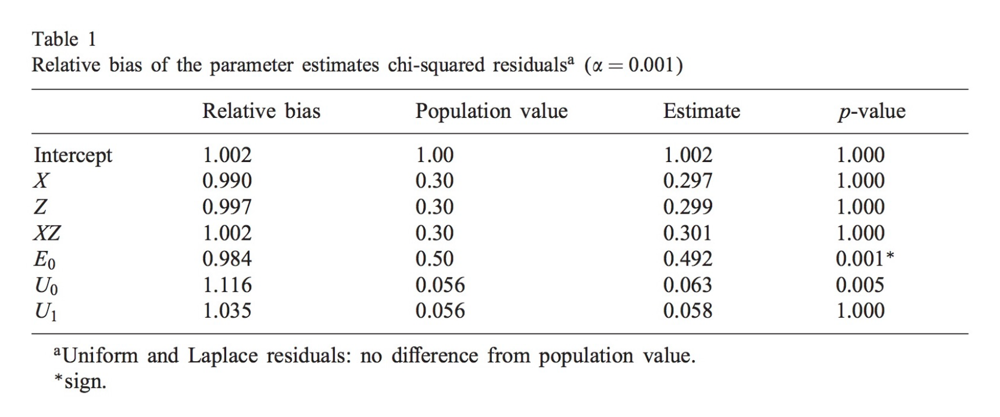
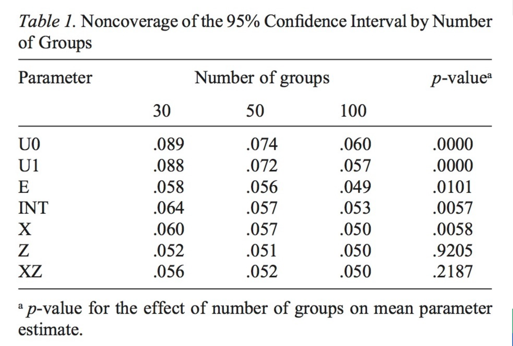

class: middle, title
background-size: contain

<!----- 

Make a pdf using:

decktape generic --key=ArrowRight --load-pause 1800 --slides '1-91' --size '1216x684' --url-load-timeout 80000 --page-load-timeout 40000 "slides/intro-to-simulation-studies.html" slides/intro-to-simulation-studies.pdf

----->


<br><br>

# Introduction to Simulation Studies

<br>

**Dr. Andy Bell** & **Dr. Calum Webb**<br>
Sheffield Methods Institute, School of Education, the University of Sheffield<br>
[andrew.j.d.bell@sheffield.ac.uk](mailto:andrew.j.d.bell@sheffield.ac.uk)<br>
[c.j.webb@sheffield.ac.uk](mailto:c.j.webb@sheffield.ac.uk)

```{r setup, include=FALSE}
options(htmltools.dir.version = FALSE)

# These packages are required for creating the slides
# Many will need to be installed from Github
library(icons)
library(tidyverse)
library(xaringan)
library(xaringanExtra)
library(xaringanthemer)

# Defaults for code
knitr::opts_chunk$set(
  fig.width=9, fig.height=3.5, fig.retina=3,
  out.width = "100%",
  cache = FALSE,
  echo = TRUE,
  message = FALSE, 
  warning = FALSE,
  fig.show = TRUE,
  hiline = TRUE
)

# set global theme for ggplot to make background #F8F8F8F8 (off white),
# but otherwise keep all ggplot themes default (better for teaching)
theme_set(
  theme(plot.background = element_rect(fill = "#F8F8F8", colour = "#F8F8F8"), 
        panel.background = element_rect(fill = "#F8F8F8", colour = "#F8F8F8"),
        legend.background = element_rect(fill = "#F8F8F8", colour = "#F8F8F8")
        )
  )

```

```{r xaringan-tile-view, echo=FALSE}
# Use tile overview by hitting the o key when presenting
xaringanExtra::use_tile_view()
```

```{r xaringan-logo, echo=FALSE}
# Add logo to top right
xaringanExtra::use_logo(
  image_url = "header/smi-logo-white.png",
  exclude_class = c("inverse", "hide_logo"), 
  width = "180px", position = css_position(top = "1em", right = "2em")
)

xaringanExtra::use_tachyons()
```

```{r xaringan-themer, include=FALSE, warning=FALSE}

# Set some global objects containing the colours
# of the university's branding
primary_color <- "#131E29"
secondary_color <- "#440099"
tuos_blue <- "#9ADBE8"
white = "#F8F8F8"
tuos_yellow <- "#FCF281"
tuos_purple <- "#440099"
tuos_red <- "#E7004C"
tuos_midnight <- "#131E29"

# The bulk of the styling is handled by xaringanthemer
style_duo_accent(
  primary_color = "#131E29",
  secondary_color = "#440099",
  colors = c(tuos_purple = "#440099", 
             grey = "#131E2960", 
             tuos_blue ="#9ADBE8",
             tuos_mint = "#00CE7C"),
  header_font_google = xaringanthemer::google_font("Source Serif Pro", "600", "600i"),
  text_font_google   = xaringanthemer::google_font("Source Sans Pro", "300", "300i", "600", "600i"),
  code_font_google   = xaringanthemer::google_font("Lucida Console"),
  header_h1_font_size = "2rem",
  header_h2_font_size = "1.5rem", 
  header_h3_font_size = "1.25rem", 
  text_font_size = "0.9rem",
  code_font_size = "0.65rem", 
  code_inline_font_size = "0.85rem",
  inverse_text_color = "#9ADBE8", 
  background_color = "#F8F8F8", 
  text_color = "#131E29", 
  link_color = "#005A8F", 
  inverse_link_color = "#F8F8F8",
  text_slide_number_color = "#44009970",
  table_row_even_background_color = "transparent", 
  table_border_color = "#44009970",
  text_bold_font_weight = 600
)

```


```{r xaringan-panelset, echo=FALSE}
# Allow for adding panelsets (see example on slide 2)
xaringanExtra::use_panelset()
```

```{r xaringanExtra, echo = FALSE}
# Adds white progress bar to top
xaringanExtra::use_progress_bar(color = "#F8F8F8", location = "top")
```

```{r xaringan-extra-styles, echo = FALSE}
# Allow for code to be highlighted on hover
xaringanExtra::use_extra_styles(
  hover_code_line = TRUE,         #<<
  mute_unhighlighted_code = TRUE  #<<
)
```

```{r share-again, echo=FALSE}
# Add sharing links and other embedding tools
xaringanExtra::use_share_again()
```

```{r xaringanExtra-search, echo=FALSE}
# Add magnifying glass search function to bottom left for quick
# searching of slides
xaringanExtra::use_search(show_icon = TRUE, auto_search = FALSE)
```

---

class: middle

## Plan for the day:

* Lecture: What are simulations good for?
* Lecture: The logic of a simulation study.
* Practical exercise: A simple simulation of omitted variable bias.

**Lunch**

* Lecture: Simulation quantities of interest
* Lecture: Presenting simulation results
* Practical exercise: Conducting many simulations and creating a dataset of the quantities of interest


---

class: inverse, middle

.pull-left-big[

<br>

# Lecture 1: Introduction to Simulation Studies

]

.pull-right-small[

.center[

```{r, echo = FALSE, out.width = "70%", fig.alt="An icon of an old style desktop computer"}


```

]

]


---

class: middle

.center[

.bg-white.b--purple.ba.bw2.br3.shadow-5.ph4[

```{r, echo = FALSE, out.width = "90%", fig.alt="An image of a Wikipedia article about simulation, which humorously contains the warning 'Not to be confused with Stimulation'"}



```

]

]

---

class: middle

.pull-left[

#### What are simulation studies?

* Lots of different meanings: including as a methodology in itself (e.g. spatial micro-simulation)
* Here, we are interested in using simulated data to test whether a model / a methodology works as we expect it to
* Difficult with real data, as we don’t know how it came about

]

--

.pull-right[

So: 

1. Take a dataset that we know the truth about
2. Run a model using that dataset
3. See whether the results that are produced are accurate
4. Repeat this multiple times to check results weren’t by chance.
5. See under what conditions the model is accurate


]

---

class: inverse

.pull-left[

<br><br><br><br><br>

## Why would we want to spend an entire day learning about simulation?

]

.pull-right[

<br><br><br><br><br>

* A geeky interest in the models themselves
* To test whether a model that you want to use for a substantive topic works
* To really understand what a model is really doing
* As a way of (re)learning basic statistics that we should know already, but don’t.


]

---

class: inverse

.pull-left[

<br><br><br><br><br>

## Why would we want to spend an entire day learning about simulation?

]

.pull-right[

<br><br><br><br><br>

* A geeky interest in the models themselves
* To test whether a model that you want to use for a substantive topic works
* To really understand what a model is really doing
* As a way of (re)learning basic statistics that we should know already, but don’t.

But...

* Simulations seem a bit artificial - how do we know they have anything to do with the real world.
* This was my attitude when a reviewer first asked me to conduct a simulation. (And it's not just me...)

]


---

class: inverse, middle, no-header

.bg-white.b--lightest-blue.ba.bw2.br3.shadow-5.ph4[

.center[
```{r, echo = FALSE, out.width = "65%", fig.alt="An image of the abstract, title, and author list from an article by Reither et al. where the authors argue that one of Andy Bell's articles is unproductive because his simulations are contrived."}


```

]]


---

class: inverse, middle


# To what extent do simulations reflect reality? To what extent do they need to reflect reality?


---

class: middle

.pull-left[

<br><br>

#### To what extent do they need to reflect reality?

My view: If a mathematical model can draw out interesting things about society (I think it can) then a mathematically simulated dataset can tell us interesting things about the model’s relation to real data.

That doesn’t mean models, or simulation, can tell us everything about the world: simulations as an important initial test

]


.pull-right[


.center[
```{r, echo = FALSE, out.width = "60%", fig.alt="A purely decorative image of the globe in a simple wireframe."}


```
]

]


---

class: middle

# What can be wrong with models?

* They give inaccurate answers on average (bias)
* They give correct answers on average, but with not as much precision as another model
* They give correct answers but the precision is inaccurately estimated
* They give the correct answer, but to a different question to what you thought
* A combination of the above

---

class: middle

.center[

```{r, echo = FALSE, out.width="50%", fig.alt="An image of four targets with the labels unbiased, imprecise in the top left, biased and precide in the top right, unbiased and imprecise in the bottom left, and biased and imprecise in the bottom right. In the unbiased and precise target there are several holes that are all on the bullseye almost exactly. In the biased and precise target there is a close cluster of holes, but these are away from the bullseye. In the unbiased but imprecise target there are holes that are spread out all over the place around the bullseye. In the biased and imprecise target there are holes that are spread out a lot and they are all below the bullseye."}



```

]

---

class: middle

.pull-left[

# What causes models to be wrong?

]

.pull-right[

* Sample size too small
* Omitted variables
* Poor performing estimator
* Reverse causality
* Model specified wrong in some other way
* Missing data

]


---

class: middle

.pull-left[

# What do we mean by wrong?

]

.pull-right[

If a model is biased… what is it biased from? And is that thing what we were really expecting to find?

> Example: failing to control for ‘cultural differences’ in finding effect of race

Results should always be situated in some kind of reality!

]

---

<br><br>

# FE versus RE & Age, Period Cohort Analysis

.pull-left[

### Fixed Effects and Random Effects

* Conventional wisdom: FE ‘gold standard’, RE affected by omitted variables
* But FE is limited (e.g no higher level variables can be estimated)
* Bell and Jones (2015) – shows RE with group means produces same results
* Also showed problems with SEs for FEVD

<hr>

**Result**: a change in advice of what researchers should do

*Bring into question results of some models (eg using the FEVD)*


]

--

.pull-right[

### Age-Period-Cohort Models

* Age = Period – Cohort, so model cannot include all three (exactly colinearity)
* Various proposed ‘solutions’ to the identification problem, and justified with simulations
* Bell and Jones (various) show situations where these models do not work (by changing the DGP used
in simulations

<hr>

**Result** A change in academic practice using these models?

]


---

class: middle, center

.bg-white.b--purple.ba.bw2.br3.shadow-5.ph4[

```{r, echo = FALSE, out.width="50%", fig.alt="A figure shows the difference in results for age, period and cohort effects where the models do not estimate an accurate effect of each according to the simulated data generating process."}



```

]

---

class: middle


# Summary

* These sorts of studies can have a big impact in challenging standard practice
* But are also an important way to understand what we are doing with our models

**I didn’t really understand SEs until I started simulating things!**


---

class: inverse, middle

.pull-left-big[

<br>

# Lecture 2: The logic of a simulation study

]

.pull-right-small[

.center[

```{r, echo = FALSE, out.width = "70%", fig.alt="A decorative icon of a flowchart"}


```

]

]


---

class: middle

.pull-left[

## What really is a regression model anyway?

A regression model is a **description** of data that we have observed. However, we can use that description as a way to generate data. 

This is an oversimplified representation of the world / the "truth". Literally: a model. 

]

.pull-right[

<br><br><br>

**Linear regression model:**

$$Y = B_0 + B_1X_1 + e$$

]

---

class: middle

.pull-left[

## What really is a regression model anyway?

A regression model is a **description** of data that we have observed. However, we can use that description as a way to generate data. 

This is an oversimplified representation of the world / the "truth". Literally: a model. 

]

.pull-right[


**Linear regression model:**

$$Y = B_0 + B_1X_1 + e$$

$B_1$: The average change in Y for a one-unit change in X. From a frequentist perspective, every repeat study of a given sample size will have some error in this value that is normally distributed around the true (population) value. 

From a Bayesian perspective, multiple values of $B_1$ are plausible and these are usually normally distributed.

]


---

class: middle

.pull-left[

## What really is a regression model anyway?

A regression model is a **description** of data that we have observed. However, we can use that description as a way to generate data. 

This is an oversimplified representation of the world / the "truth". Literally: a model. 

]

.pull-right[


**Linear regression model:**

$$Y = B_0 + B_1X_1 + e$$

$X_1$: Our observations of the variable X from our sample will be the product of its own data generating process that results in a distribution, and will have some measurement error (e.g. a sample of incomes from the wider population will reflect a positively skewed normal distribution/log-normal distribution). 

Every set of values for X we get will look slightly different depending on who is in our sample and the error in our measurement.

]


---

class: middle

.pull-left[

## What really is a regression model anyway?

A regression model is a **description** of data that we have observed. However, we can use that description as a way to generate data. 

This is an oversimplified representation of the world / the "truth". Literally: a model. 

]

.pull-right[


**Linear regression model:**

$$Y = B_0 + B_1X_1 + e$$

$e$: Sometimes called the error, $e$ can also be considered the considered the **unexplained residual** - that is, the difference between the true value of Y and that expected by the model. It is everything that cannot be predicted by $X_1$. In linear regression, it is assumed that $e$ is normally distributed.

]


---

class: middle

.pull-left[

<br><br><br><br>

## Working backwards from a linear regression to simulated data...

With these pieces of information we can simulate what Y might look like.

$$Y = B_0 + B_1X_1 + e$$

$B_0$ = 0,
$B_1$ = ???,
$X_1$ = ???,
$e$ = ???

]


.pull-right[

```{r, echo=FALSE, fig.height=5, fig.width=5, out.width=500, out.height=500, fig.alt="A scatterplot where only a line is present at y = 0"}

set.seed(100)

sim <- tibble(
  y = rep(0, 200),
  x = rep(0, 200)
)


ggplot(data = sim) +
  geom_hline(yintercept = 0) +
  ylab("Y") +
  xlab("X") +
  xlim(c(-3,3)) +
  ylim(c(-3,3))


```


]


---

class: middle

.pull-left[

<br><br><br>

## Working backwards from a linear regression to simulated data...

With these pieces of information we can simulate what Y might look like.

$$Y = B_0 + B_1X_1 + e$$

$B_0$ = 0,
$B_1$ = ???,
$X_1$ = $N(0, 1)$,
$e$ = ???

\* $N(0, 1)$ means "A normally distributed variable with a mean of 0 and a standard deviation of 1".

]


.pull-right[

```{r, echo=FALSE, fig.height=5, fig.width=5, out.width=500, out.height=500, fig.alt="A scatterplot where variation is only shown along the X axis"}

set.seed(100)

sim <- tibble(
  y = rep(0, 200),
  x = rnorm(200, 0, 1)
)


ggplot(data = sim) +
  geom_point(aes(x = x, y = y)) +
  geom_smooth(aes(x = x, y = y), method = "lm", se = F, colour = tuos_purple) +
  ylab("Y") +
  xlab("X") +
  xlim(c(-3,3)) +
  ylim(c(-3,3))


```


]


---

class: middle

.pull-left[

<br><br><br>

## Working backwards from a linear regression to simulated data...

With these pieces of information we can simulate what Y might look like.

$$Y = B_0 + B_1X_1 + e$$

$B_0$ = 0,
$B_1$ = 0.5,
$X_1$ = $N(0, 1)$,
$e$ = ???

\* $N(0, 1)$ means "A normally distributed variable with a mean of 0 and a standard deviation of 1".

]


.pull-right[

```{r, echo=FALSE, fig.height=5, fig.width=5, out.width=500, out.height=500, fig.alt="A scatterplot where variation is shown across the x and y axis but the dots all follow a perfect, deterministic, line with no error."}

set.seed(100)

sim <- tibble(
  x = rnorm(200, 0, 1),
  y = 0.5*x
)


ggplot(data = sim) +
  geom_point(aes(x = x, y = y)) +
  geom_smooth(aes(x = x, y = y), method = "lm", se = F, colour = tuos_purple) +
  ylab("Y") +
  xlab("X")


```


]


---

class: middle

.pull-left[

<br><br><br>

## Working backwards from a linear regression to simulated data...

With these pieces of information we can simulate what Y might look like.

$$Y = B_0 + B_1X_1 + e$$

$B_0$ = 0,
$B_1$ = 0.5,
$X_1$ = $N(0, 1)$,
$e$ = $N(0, 1)$

\* $N(0, 1)$ means "A normally distributed variable with a mean of 0 and a standard deviation of 1".

]


.pull-right[

```{r, echo=FALSE, fig.height=5, fig.width=5, out.width=500, out.height=500, fig.alt="A scatterplot showing a relationship between X and Y but with a lot of error/large, random residuals"}

set.seed(100)

sim <- tibble(
  x = rnorm(200, 0, 1),
  y = 0.5*x + rnorm(200, 0, 1)
)


ggplot(data = sim) +
  geom_point(aes(x = x, y = y)) +
  geom_smooth(aes(x = x, y = y), method = "lm", se = F, colour = tuos_purple) +
  ylab("Y") +
  xlab("X") +
  xlim(c(-3,3)) +
  ylim(c(-3,3))


```


]


---

class: middle

.pull-left[

<br>

## Working backwards from a linear regression to simulated data...

With these pieces of information we can simulate what Y might look like.

$$Y = B_0 + B_1X_1 + e$$

$B_0$ = 0,
$B_1$ = 0.5,
$X_1$ = $N(0, 1)$,
$e$ = $N(0, 1)$

\* $N(0, 1)$ means "A normally distributed variable with a mean of 0 and a standard deviation of 1".

**Each time we simulate the data, the results will change a little bit because the values of $X$ and $e$ will be drawn at random from their distributions.**

]


.pull-right[

```{r, echo=FALSE, fig.height=5, fig.width=5, out.width=500, out.height=500, fig.alt="The same scatterplot as before is shown, but this time the error and regression line is slightly different."}

set.seed(102)

sim <- tibble(
  x = rnorm(200, 0, 1),
  y = 0.5*x + rnorm(200, 0, 1)
)


ggplot(data = sim) +
  geom_point(aes(x = x, y = y)) +
  geom_smooth(aes(x = x, y = y), method = "lm", se = F, colour = tuos_purple) +
  ylab("Y") +
  xlab("X") +
  xlim(c(-3,3)) +
  ylim(c(-3,3))


```


]


---

class: middle

.pull-left[

<br>

## Working backwards from a linear regression to simulated data...

With these pieces of information we can simulate what Y might look like.

$$Y = B_0 + B_1X_1 + e$$

$B_0$ = 60,
$B_1$ = 1,
$X_1$ = $N(6, 1)$,
$e$ = $N(0, 10)$

\* $N(0, 1)$ means "A normally distributed variable with a mean of 0 and a standard deviation of 1".

**We can change the values of the distribution to represent real-world variables better, e.g. $Y$ = Test Grade, $X_1$ = Average Hours of Sleep.**

]


.pull-right[

```{r, echo=FALSE, fig.height=5, fig.width=5, out.width=500, out.height=500, fig.alt="A similar scatterplot to before but now the scales have changes and are labelled Hours of Sleep and Test Grade"}

set.seed(102)

sim <- tibble(
  x = rnorm(200, 6, 1),
  y = 60 + 1*x + rnorm(200, 0, 10)
)


ggplot(data = sim) +
  geom_point(aes(x = x, y = y)) +
  geom_smooth(aes(x = x, y = y), method = "lm", se = F, colour = tuos_purple) +
  ylab("Test Grade") +
  xlab("Hours of Sleep") 


```


]


---

class: middle

.pull-left[

<br>

## Working backwards from a linear regression to simulated data...

With these pieces of information we can simulate what Y might look like.

$$Y = B_0 + B_1X_1 + e$$

$B_0$ = 60,
$B_1$ = 1,
$X_1$ = $N(0, 1)$,
$e$ = $Lognormal(0, 1)$

\* $N(0, 1)$ means "A normally distributed variable with a mean of 0 and a standard deviation of 1".

**We could also change the distributions that we are using to see what kind of effect it has, for example, if the error was log-normal distributed... (but we won't really go into that in this course)**

]


.pull-right[

```{r, echo=FALSE, fig.height=5, fig.width=5, out.width=500, out.height=500, fig.alt="The same scatterplot as before but now the error is non-normally distributed, the points above the regression line are very dispersed and those below it are not"}

set.seed(102)

sim <- tibble(
  x = rnorm(200, 6, 1),
  y = 60 + 1*x + (rlnorm(200, 0, 1))
)


ggplot(data = sim) +
  geom_point(aes(x = x, y = y)) +
  geom_smooth(aes(x = x, y = y), method = "lm", se = F, colour = tuos_purple) +
  ylab("Test Grade") +
  xlab("Hours of Sleep") 


```


]


---

```{r, echo = FALSE}

coeff_tab <- tibble(
  b0 = numeric(),
  b1 = numeric()
)

set.seed(2000)

for (i in 1:200) {
  
  sim <- tibble(
  x = rnorm(200, 6, 1),
  y = 60 + 1*x + (rnorm(200, 0, 10))
)
  
  reg <- lm(data = sim, y ~ x)
  
  coeff_tab <- coeff_tab %>% bind_rows(
    tibble(
      b0 = coef(reg)[[1]],
      b1 = coef(reg)[[2]]
    )
  )
  
}


```

.pull-left[

## Simulation shows how uncertainty (of effect, Bayesian, or of sample, Frequentist) plays out

On the right are the regression lines for 200 simulations based on the regression equation in the previous slides with a sample size of 200 (with the last simulation's data overlaid on top).

* If our sample is truly random, our estimates of B0 and B1 should be normally distributed around the true value.

Here's the first five results for $B_0$ and $B_1$:

```{R, echo = FALSE}

head(coeff_tab, 5) %>%
  mutate_all(~round(., 2)) %>%
  knitr::kable(col.names = c("$B_0$", "$B_1$"))

```


]


.pull-right[

<br>

```{r, echo = FALSE, fig.height=5, fig.width=5, out.width=500, out.height=500, fig.alt="A scatterplot but this time showing many, many regression lines (200) all with some small amount of variation"}

ggplot(data = coeff_tab %>% slice(1:200)) +
  geom_point(data = sim, aes(x = x, y = y)) +
  geom_abline(aes(intercept = b0, slope = b1), linewidth = 0.1, alpha = 0.5, colour = tuos_purple) +
  coord_cartesian(xlim = c(3,10), ylim = c(30, 100)) +
  ylab("Test Grade") +
  xlab("Hours of Sleep") 

```

]


---

```{r, echo = FALSE}

coeff_tab <- tibble(
  b0 = numeric(),
  b1 = numeric()
)

set.seed(2000)

for (i in 1:200) {
  
  sim <- tibble(
  x = rnorm(1000, 6, 1),
  y = 60 + 1*x + (rnorm(1000, 0, 10))
)
  
  reg <- lm(data = sim, y ~ x)
  
  coeff_tab <- coeff_tab %>% bind_rows(
    tibble(
      b0 = coef(reg)[[1]],
      b1 = coef(reg)[[2]]
    )
  )
  
}


```

.pull-left[

## Simulation shows how uncertainty (of effect, Bayesian, or of sample, Frequentist) plays out

On the right are the regression lines for 200 simulations based on the regression equation in the previous slides with a sample size of 1000 (with the last simulation's data overlaid on top).

* If our sample is truly random, our estimates of B0 and B1 should be normally distributed around the true value.

Here's the first five results for $B_0$ and $B_1$:

```{R, echo = FALSE}

head(coeff_tab, 5) %>%
  mutate_all(~round(., 2)) %>%
  knitr::kable(col.names = c("$B_0$", "$B_1$"))

```


]


.pull-right[

<br>

```{r, echo = FALSE, fig.height=5, fig.width=5, out.width=500, out.height=500, fig.alt="The same scatterplot as before, but this time the regression lines from the simulations are all much closer together because of the sample size increasing from 200 to 1000"}

ggplot(data = coeff_tab %>% slice(1:200)) +
  geom_point(data = sim, aes(x = x, y = y)) +
  geom_abline(aes(intercept = b0, slope = b1), linewidth = 0.1, alpha = 0.5, colour = tuos_purple) +
  coord_cartesian(xlim = c(3,10), ylim = c(30, 100)) +
  ylab("Test Grade") +
  xlab("Hours of Sleep")

```

]


---

class: middle, center

```{r, echo = FALSE, fig.width = 8, fig.height=5.5, out.height=550, out.width=800, fig.alt="A density plot shows the true expected distribution (a perfectly normal distribution centred around 1) and a 'spikier' empirical distribution based on simulation results. Most of the simulation results fit within the empirical distribution."}

library(latex2exp)

ggplot() +
  geom_density(data = coeff_tab, aes(x = b1), bw = 0.03, colour = tuos_purple, fill = tuos_purple, alpha = 0.1) +
  stat_function(fun = dnorm, args = list(mean = 1, sd = 0.32)) +
  xlim(c(-1, 3)) +
  ylab("Density") +
  xlab(TeX("$B_1$ Simulations + Estimate from a Single Regression Model"))


```


---

.pull-left[

<br>

# Building up the complexity

Most of the time we're going to be interested in models with more than one independent variable. Moreover, we're likely to be interested in know how **the presence or absence of variables that are associated with both our key predictors of interest and our outcome, and the strength of association, influences our results.**

* How bad would the difference in propensity to non-respond to a survey need to be to invalidate the results?


]

---

.pull-left[

<br>

# Building up the complexity

Most of the time we're going to be interested in models with more than one independent variable. Moreover, we're likely to be interested in know how **the presence or absence of variables that are associated with both our key predictors of interest and our outcome, and the strength of association, influences our results.**

* How bad would the difference in propensity to non-respond to a survey need to be to invalidate the results?

**Cornfield Conditions Study**:

* In the 1950s, many statisticians (including Karl Pearson) believed there was no good evidence that smoking caused cancer because an omitted, unmeasurable variable, whether someone has a **smoking gene** that makes them more likely to smoke and more likely to develop lung cancer, could exist.
* Jerome Cornfield demonstrated that the effect of such an omitted variable would have to be implausibly large in order to "explain away" the link between smoking and cancer.


]

--

.pull-right[

<br>

.center[.middle[

```{r, echo = FALSE, out.width=500, out.height=500, fig.width=5, fig.height=5, fig.alt="A directed acyclic graph diagram shows three nodes, labelled smoking, cancer, and gene. There is an arrow going from smoking to cancer. There is an arrow going from gene to smoking and a second arrow going from gene to concer."}

library(dagitty)
library(ggdag)

dag <- "{smoking -> cancer
        gene -> {smoking cancer}
}
"

dag <- dagitty(dag) 
coordinates(dag) <- list(
  x = c(smoking = 1, gene = 2, cancer = 3),
  y = c(smoking = 1, gene = 2, cancer = 1)
)

dag_cornfield <- tidy_dagitty(dag) %>%
  ggplot() +
  aes(x = x, y = y, xend = xend, yend = yend) +
  geom_dag_point(stroke = 0, colour = tuos_purple, size = 30) +
  geom_dag_edges(start_cap = ggraph::circle(20, 'mm'),
                            end_cap = ggraph::circle(20, 'mm')) +
  geom_dag_text() +
  theme_dag() +
  expand_plot(expand_y = expansion(add = 0.3), expand_x = expansion(add = 0.3)) +
  theme(plot.background = element_rect(fill = white, colour = white))

dag_cornfield


```

]

]]


---

.pull-left[

<br>

# Building up the complexity

**The order of simulation**

* Identify a variable/variables that are not a product of any other variables (i.e. they only have arrows going away from them, not to them)


]

.pull-right[

<br>

.center[.middle[

```{r, echo = FALSE, out.width=500, out.height=500, fig.width=5, fig.height=5, fig.alt="A directed acyclic graph diagram shows three nodes, labelled smoking, cancer, and gene. There is an arrow going from smoking to cancer. There is an arrow going from gene to smoking and a second arrow going from gene to concer."}

dag_cornfield 

```

]

]]

---

.pull-left[

<br>

# Building up the complexity

**The order of simulation**

* Identify a variable/variables that are not a product of any other variables (i.e. they only have arrows going away from them, not to them)
* Simulate those variables.

<br>

$$
  \begin{split}
  gene & = N(\mu_1, \sigma_1)\\\
  \end{split}
$$


]

.pull-right[

<br>

.center[.middle[

```{r, echo = FALSE, out.width=500, out.height=500, fig.width=5, fig.height=5, fig.alt = "A directed acyclic graph diagram shows three nodes, labelled smoking, cancer, and gene. There is an arrow going from smoking to cancer. There is an arrow going from gene to smoking and a second arrow going from gene to concer. The node gene is lit up because it has no pre-requisite causes."}

tidy_dagitty(dag) %>%
  ggplot() +
  aes(x = x, y = y, xend = xend, yend = yend) +
  geom_dag_point(aes(colour = name), stroke = 0, size = 30) +
  geom_dag_edges(start_cap = ggraph::circle(20, 'mm'),
                            end_cap = ggraph::circle(20, 'mm')) +
  geom_dag_text() +
  theme_dag() +
  expand_plot(expand_y = expansion(add = 0.3), expand_x = expansion(add = 0.3)) +
  theme(plot.background = element_rect(fill = white, colour = white), legend.position = "none") +
  scale_colour_manual(values = c(tuos_midnight, tuos_purple, tuos_midnight))

```

]

]]


---

.pull-left[

<br>

# Building up the complexity

**The order of simulation**

* Identify a variable/variables that are not a product of any other variables (i.e. they only have arrows going away from them, not to them)
* Simulate those variables.
* Now you have a new variable, you can identify which other variables you now have the pieces of to simulate. 

<br>

$$
  \begin{split}
  gene & = N(\mu_1, \sigma_1)\\\
  smoking  & = B_0 + B_1gene + e_1\\\
  e_1 & = N(0, \sigma_2)\\\
  \end{split}
$$


]

.pull-right[

<br>

.center[.middle[

```{r, echo = FALSE, out.width=500, out.height=500, fig.width=5, fig.height=5, fig.alt = "A directed acyclic graph diagram shows three nodes, labelled smoking, cancer, and gene. There is an arrow going from smoking to cancer. There is an arrow going from gene to smoking and a second arrow going from gene to concer. The node smoking is now lit up because all pre-requisites for its simulation have been met."}

tidy_dagitty(dag) %>%
  ggplot() +
  aes(x = x, y = y, xend = xend, yend = yend) +
  geom_dag_point(aes(colour = name), stroke = 0, size = 30) +
  geom_dag_edges(start_cap = ggraph::circle(20, 'mm'),
                            end_cap = ggraph::circle(20, 'mm')) +
  geom_dag_text() +
  theme_dag() +
  expand_plot(expand_y = expansion(add = 0.3), expand_x = expansion(add = 0.3)) +
  theme(plot.background = element_rect(fill = white, colour = white), legend.position = "none") +
  scale_colour_manual(values = c(tuos_midnight, tuos_purple, tuos_purple))

```

]

]]

---

.pull-left[

<br>

# Building up the complexity

**The order of simulation**

* Identify a variable/variables that are not a product of any other variables (i.e. they only have arrows going away from them, not to them)
* Simulate those variables.
* Now you have a new variable, you can identify which other variables you now have the pieces of to simulate. 
* Repeat until you have simulated all of your variables.

<br>

$$
  \begin{split}
  gene & = N(\mu_1, \sigma_1)\\\
  smoking  & = B_0 + B_1gene + e_1\\\
  cancer & = B_3 + B_4smoking + B_5gene + e_2\\\
  e_1 & = N(0, \sigma_2)\\\
  e_2 & = N(0, \sigma_3)
  \end{split}
$$

]

.pull-right[

<br>

.center[.middle[

```{r, echo = FALSE, out.width=500, out.height=500, fig.width=5, fig.height=5, fig.alt="A directed acyclic graph diagram shows three nodes, labelled smoking, cancer, and gene. There is an arrow going from smoking to cancer. All three nodes are now lit up because they can all be simulated."}

dag_cornfield

```

]

]]


---

.pull-left[

<br>

# Building up the complexity

**The order of simulation**

* Identify a variable/variables that are not a product of any other variables (i.e. they only have arrows going away from them, not to them)
* Simulate those variables.
* Now you have a new variable, you can identify which other variables you now have the pieces of to simulate. 
* Repeat until you have simulated all of your variables.

<br>

**A warning**: This does become a bit more complicated when it comes to more complex relationships between variables: simulation of trends, multilevel data structures, latent factors, bidirected relationships, etc. but the general principle stays the same.

]

.pull-right[

<br>

.center[.middle[

```{r, echo = FALSE, out.width=500, out.height=500, fig.width=5, fig.height=5, fig.alt="A directed acyclic graph diagram shows three nodes, labelled smoking, cancer, and gene. There is an arrow going from smoking to cancer. There is an arrow going from gene to smoking and a second arrow going from gene to concer."}

dag_cornfield

```

]

]]


---

.pull-left[

<br><br>

# One simulation to many...

Now that you have a simulation that works (represents the underlying data generating process), we need to repeat it many, many, times, to see what happens. Some things to keep in mind:

* Can someone reproduce your results?
* Is there a clear description of what each part of your code is intended to do?
* What things do you actually want to vary, how much work will that be, and how fine-grained do the conditions need to be:
  * Sample size?
  * Relationship between confounder and outcome?
  * Relationship between confounder and predictor?
  * Both?
  * Distribution of the error terms?

]

--

.pull-right[

<br><br>

# Best practice

1. Random is not truly random. Randomness is generated based on starting conditions. These can be set to be the same across several instances of a script by **setting a seed** that determines the randomness.
2. **Generate your data** using your simulation code
3. **Estimate your model**
4. **Save the results** for the things you're interested in (parameters, SEs, etc.)
5. **Repeat** with different randomness (re-sampling from the same data generating process)
6. **Repeat** under different conditions (different confounding effects, different sample sizes, etc.)

*Only change one thing at a time unless you're interested in how the two things interact with each other*.

]

---

class: middle

# Exercise 1

In the first exercise, we'll be building up a simple simulation similar to the graph we've just looked at (an outcome (Y), a predictor of interest (X), and a confounder (Z)) and see **what happens to our estimates of our regression coefficient** if we exclude this confounder. We'll then look at how the strength of that confounder's relationship with the outcome affects that estimate.

You'll then be tasked with creating your own code seeing what happens if Z is a collider instead of a confounder, meaning a variable that is caused by both X and Y.


---

class: middle

.pull-left[

# Demonstration

How does the treatment of a confounder change our predictions?

.center[

```{r, echo = FALSE, out.width=400, out.height=400, fig.width=4, fig.height=4, fig.alt="A directed acyclic graph diagram shows three nodes, labelled x, z, and y There is an arrow going from x to y There is an arrow going from z to x and a second arrow going from z to y"}

dag <- "{x -> y
        z -> {x y}
}
"

dag <- dagitty(dag) 
coordinates(dag) <- list(
  x = c(x = 1, z = 2, y = 3),
  y = c(x = 1, z = 2, y = 1)
)

tidy_dagitty(dag) %>%
  ggplot() +
  aes(x = x, y = y, xend = xend, yend = yend) +
  geom_dag_point(stroke = 0, colour = tuos_purple, size = 30) +
  geom_dag_edges(start_cap = ggraph::circle(20, 'mm'),
                            end_cap = ggraph::circle(20, 'mm')) +
  geom_dag_text() +
  theme_dag() +
  expand_plot(expand_y = expansion(add = 0.3), expand_x = expansion(add = 0.3)) +
  theme(plot.background = element_rect(fill = white, colour = white))


```

]

]

.pull-right[

# Exercise

How does the treatment of a collider change our predictions?

.center[

```{r, echo = FALSE, out.width=400, out.height=400, fig.width=4, fig.height=4, fig.alt = "A directed acyclic graph diagram shows three nodes, labelled x, z, and y. There is an arrow going from x to y. There is an arrow going from x to z and a second arrow going from y to z"}

dag <- "{x -> y
        {x y} -> z
}
"

dag <- dagitty(dag) 
coordinates(dag) <- list(
  x = c(x = 1, z = 2, y = 3),
  y = c(x = 1, z = 2, y = 1)
)

tidy_dagitty(dag) %>%
  ggplot() +
  aes(x = x, y = y, xend = xend, yend = yend) +
  geom_dag_point(stroke = 0, colour = tuos_purple, size = 30) +
  geom_dag_edges(start_cap = ggraph::circle(20, 'mm'),
                            end_cap = ggraph::circle(20, 'mm')) +
  geom_dag_text() +
  theme_dag() +
  expand_plot(expand_y = expansion(add = 0.3), expand_x = expansion(add = 0.3)) +
  theme(plot.background = element_rect(fill = white, colour = white))


```

]


]


---

class: middle, inverse

.pull-left-big[

<br>

# Lecture 3: Simulation quantities of interest

]

.pull-right-small[

.center[

```{r, echo = FALSE, out.width = "70%", fig.alt="An icon of a measuring tool"}


```

]

]


---

class: middle

.pull-left[

# What have we done so far?

What simulations are good for, why the they are useful, the logic of how to simulate based on a data generating process (that you can draw graphically), how to run a (single) simulation.
 
]

--

.pull-right[

# What's next?

How we can usefully summarise the results of our simulations in a standardised way, how to interpret and present those results, and how to run multiple simulations and store the results "on the fly".

]


---

class: middle

.pull-left[

# What do we want to measure?

* What does the model usually say?
* Does the model generally get it “right” on average?
* Are the results very dispersed?
* Do the measures of dispersal (SE) accurately reflect the true dispersal?

]

--

.pull-right[

# Quantities of Interest

In simulation studies, the key quantities of interest are:

* Predictions
* Bias
* Root Mean Square Error
* Optimism
* 95% coverage 


]


---

.pull-left[

<br><br><br><br>

# Repeated examples are needed

To do this, we can’t just have a single simulation
 
* That would contain random white noise - so difficult to tell what is bias and what is white noise

Instead, simulate the data lots of time (e.g. 1000 times) and see how the results vary across those


]


.pull-right[

<br>

.middle[.center[

```{r, echo = FALSE, fig.height=5, fig.width=5, out.width=500, out.height=500, fig.alt="A density plot of the true distribution is shown, with a solitary vertical line indicating a single simulation that is on the periphery of the density distribution, indicating it is not especially typical."}

coeff_tab %>%
  slice(1) %>%
  ggplot() +
  geom_vline(aes(xintercept = b1), colour = tuos_purple) +
  stat_function(fun = dnorm, args = list(mean = 1, sd = 0.32)) +
  xlim(c(-1, 3)) +
  ylab("Density") +
  xlab(TeX("A single simulation of $B_1$ — bias or noise?"))


```

]]

]


---

class: middle

.center[

```{r, echo = FALSE, out.width="50%", fig.alt="An image of four targets with the labels unbiased, imprecise in the top left, biased and precide in the top right, unbiased and imprecise in the bottom left, and biased and imprecise in the bottom right. In the unbiased and precise target there are several holes that are all on the bullseye almost exactly. In the biased and precise target there is a close cluster of holes, but these are away from the bullseye. In the unbiased but imprecise target there are holes that are spread out all over the place around the bullseye. In the biased and imprecise target there are holes that are spread out a lot and they are all below the bullseye."}


```

]


---

.pull-left[

<br><br><br><br><br>

# Predictions

We can make predictions from the model, based on some, or all, of the estimated parameters and compare these to predictions from the DGP

Useful for visualising problems (covered in the next lecture).

But can’t quantify the problem in a standard way, difficult to compare models/specifications, etc.


]


.pull-right[

.center[

<br>

```{r, echo = FALSE, out.width="95%", fig.alt="An image of four targets with the labels unbiased, imprecise in the top left, biased and precide in the top right, unbiased and imprecise in the bottom left, and biased and imprecise in the bottom right. In the unbiased and precise target there are several holes that are all on the bullseye almost exactly. In the biased and precise target there is a close cluster of holes, but these are away from the bullseye. In the unbiased but imprecise target there are holes that are spread out all over the place around the bullseye. In the biased and imprecise target there are holes that are spread out a lot and they are all below the bullseye."}


```

]

]

---

.pull-left[

<br><br>

# Bias

> We want to estimate how far off the average of the simulations is

Two ways of estimating this:

* (1) as a ratio: Bias = estimate / truth
  * In this case, a perfect result is 1

$$\text{Bias} = 100\times(\frac{\bar{B}}{B_{\text{true}}})$$

$\bar{B}$ = B-bar = The mean of all parameter estimates from the simulations

$B_{\text{true}}$ = B true = The true value of B specified in the simulation


]


.pull-right[

.center[

<br>

```{r, echo = FALSE, out.width="95%", fig.alt="An image of four targets with the labels unbiased, imprecise in the top left, biased and precide in the top right, unbiased and imprecise in the bottom left, and biased and imprecise in the bottom right. In the unbiased and precise target there are several holes that are all on the bullseye almost exactly. In the biased and precise target there is a close cluster of holes, but these are away from the bullseye. In the unbiased but imprecise target there are holes that are spread out all over the place around the bullseye. In the biased and imprecise target there are holes that are spread out a lot and they are all below the bullseye."}


```

]

]


---

.pull-left[


# Bias

> We want to estimate how far off the average of the simulations is

Two ways of estimating this:

* (1) as a ratio: Bias = estimate / truth
  * In this case, a perfect result is 1

* (2) As a proportion: (estimate-truth)/truth
  * Here, the perfect result os 0
  
$$\frac{\bar{B} - B_\text{true}}{B_\text{true}} \times 100$$

]


.pull-right[

.center[

<br>

```{r, echo = FALSE, out.width="95%", fig.alt="An image of four targets with the labels unbiased, imprecise in the top left, biased and precide in the top right, unbiased and imprecise in the bottom left, and biased and imprecise in the bottom right. In the unbiased and precise target there are several holes that are all on the bullseye almost exactly. In the biased and precise target there is a close cluster of holes, but these are away from the bullseye. In the unbiased but imprecise target there are holes that are spread out all over the place around the bullseye. In the biased and imprecise target there are holes that are spread out a lot and they are all below the bullseye."}


```

]

]


---

.pull-left[

<br><br><br><br><br>

# Bias

* These measures tell us about the averages
* But not about the individual model deviations
* A model might be correct on average, but so wrong each individual time to be close to meaningless
* Often a bit of bias is worth having more precision


]


.pull-right[

.center[

<br>

```{r, echo = FALSE, out.width="95%", fig.alt="An image of four targets with the labels unbiased, imprecise in the top left, biased and precide in the top right, unbiased and imprecise in the bottom left, and biased and imprecise in the bottom right. In the unbiased and precise target there are several holes that are all on the bullseye almost exactly. In the biased and precise target there is a close cluster of holes, but these are away from the bullseye. In the unbiased but imprecise target there are holes that are spread out all over the place around the bullseye. In the biased and imprecise target there are holes that are spread out a lot and they are all below the bullseye."}


```

]

]


---

.pull-left[

<br>

# Root Mean Square Error

> We want a measure that incorporates both bias and precision

How close to the truth are the individual model runs rather than how close to the truth is the average of the model runs?

This effectively combines bias and precision/efficiency.

$$\text{RMSE} = \sqrt{\frac{\sum_{l=1}^{nsims}(\beta^{(l)}-\beta_{\text{true}})^2}{n}}$$

*The square root os the sum of each parameter estimate for each simulation minus the true value of the parameter from the data generating process squared and divided by the number of observations*.


]


.pull-right[

.center[

<br>

```{r, echo = FALSE, out.width="95%", fig.alt="An image of four targets with the labels unbiased, imprecise in the top left, biased and precide in the top right, unbiased and imprecise in the bottom left, and biased and imprecise in the bottom right. In the unbiased and precise target there are several holes that are all on the bullseye almost exactly. In the biased and precise target there is a close cluster of holes, but these are away from the bullseye. In the unbiased but imprecise target there are holes that are spread out all over the place around the bullseye. In the biased and imprecise target there are holes that are spread out a lot and they are all below the bullseye."}


```

]

]


---

.pull-left[

<br><br><br><br><br>

# What about standard errors?

* Everything so far has been about coefficient estimates
* But what about the SEs that go with them?
* These are just as important as the coefficients themselves
* Our models need to tell us the correct amount of uncertainty; they shouldn't be overly optimistic or overly pessimistic.

]


.pull-right[

.center[

<br>

```{r, echo = FALSE, out.width="95%", fig.alt="An image of four targets with the labels unbiased, imprecise in the top left, biased and precide in the top right, unbiased and imprecise in the bottom left, and biased and imprecise in the bottom right. In the unbiased and precise target there are several holes that are all on the bullseye almost exactly. In the biased and precise target there is a close cluster of holes, but these are away from the bullseye. In the unbiased but imprecise target there are holes that are spread out all over the place around the bullseye. In the biased and imprecise target there are holes that are spread out a lot and they are all below the bullseye."}


```

]

]


---

.pull-left[

<br><br>

# What about standard errors?

Fortunately, the distribution of our simulated results is exactly the uncertainty that our model should be estimating.

So we can compare our model’s estimated uncertainty (SE) to the variability of our simulations

$$\text{Optimism} = 100 \times 
\frac{
  \sqrt{\sum_{l=1}^{\text{nsims}} (\beta^{(l)} - \bar{\beta})^2}
}{
  \sqrt{\sum_{l=1}^{\text{nsims}} (\text{SE}(\beta^{(l)}))^2}
}$$

$\bar{\beta}$ = The mean of the parameter estimates from all of the simulations.


]


.pull-right[

.center[

<br>

```{r, echo = FALSE, out.width="95%", fig.alt="An image of four targets with the labels unbiased, imprecise in the top left, biased and precide in the top right, unbiased and imprecise in the bottom left, and biased and imprecise in the bottom right. In the unbiased and precise target there are several holes that are all on the bullseye almost exactly. In the biased and precise target there is a close cluster of holes, but these are away from the bullseye. In the unbiased but imprecise target there are holes that are spread out all over the place around the bullseye. In the biased and imprecise target there are holes that are spread out a lot and they are all below the bullseye."}


```

]

]


---

.pull-left[

<br><br><br><br><br>

# What about standard errors?

**Alternatively**, 95% Coverage.

* Take the 95% confidence intervals for each simulation iteration
* See what proportion of those contain the true value
* Should be 95% of them (100% is not a good result!) 


]


.pull-right[

.center[

<br>

```{r, echo = FALSE, fig.height=5, fig.width=5, out.width=500, out.height=500, fig.alt="A graph shows the 95% Confidence Intervals of a series of simulations from the same data generating process. The confidence intervals that contain the true value are coloured in purple while the confidence intervals that do not are coloured in red. 94 of the 100 lines are coloured in purple, indicating expected performance."}

obs <- 1000
b1true <- 2
results <- tibble(
  iteration = numeric(),
  sample_size = numeric(),
  b2true = numeric(),
  b1 = numeric(),
  b0 = numeric(),
  b1se = numeric(),
  b0se = numeric()
)

b2 <- 0

set.seed(2345)
for (iteration in 1:300) {
    # simulate the data
    sim <- tibble(
      e = rnorm(obs, 0, 4), # residual unexplained variance
      z = rnorm(obs, 0, 2), # simulate the confounder
      x = 0*z + rnorm(obs, 0, 2), # simulate x (impacted by confounder)
      y = 1 + b1true*x + b2*z + e # simulate y, with varying covariance with z
    )
    # create a regression model
    mod <- lm(data = sim, y ~ x)
    # create a new vector that can be appended to our 
    # results dataframe
    res <- c(
      iteration = iteration,
      sample_size = obs,
      b2true = b2, # Add the true value for b2 for this iteration
      b1 = coefficients(mod)["x"][[1]], # Add the coefficient for x for this iteration
      b0 = coefficients(mod)["(Intercept)"][[1]], # Add the intercept
      b1se = sqrt(diag(vcov(mod)))["x"][[1]], # Add the standard error for b1
      b0se = sqrt(diag(vcov(mod)))["(Intercept)"][[1]] # Add the standard error for the intercept
      )
    # append our results to our results dataframe
    results <- results %>% bind_rows(res)
}


results %>%
  slice(1:100) %>%
  mutate(
    b1_lb = b1 - 1.96*b1se,
    b1_ub = b1 + 1.96*b1se,
    colour = ifelse(b1_lb < b1true & b1_ub > b1true, tuos_purple, tuos_red)
  ) %>%
  ggplot() +
  geom_segment(
    aes(x = iteration, xend = iteration,
        y = b1_lb, yend = b1_ub, colour = colour)
  ) +
  geom_hline(yintercept = b1true) +
  scale_colour_identity() +
  xlab("Iteration") +
  ylab(TeX("$B_1$ Estimate and True Value"))


```

]

]


---

name: se-chart

.pull-left[

<br><br><br><br><br>

# What about standard errors?

**Alternatively**, 95% Coverage.

* Take the 95% confidence intervals for each simulation iteration
* See what proportion of those contain the true value
* Should be 95% of them (100% is not a good result!) 


]


.pull-right[

.center[

<br>

```{r, echo = FALSE, fig.height=5, fig.width=5, out.width=500, out.height=500, fig.alt="A graph shows the 95% Confidence Intervals of a series of simulations from the same data generating process. The confidence intervals that contain the true value are coloured in purple while the confidence intervals that do not are coloured in red. Only around half of the lines are coloured in purple, indicating poor coverage."}

obs <- 1000
b1true <- 2
results <- tibble(
  iteration = numeric(),
  sample_size = numeric(),
  b2true = numeric(),
  b1 = numeric(),
  b0 = numeric(),
  b1se = numeric(),
  b0se = numeric()
)

b2 <- 0

set.seed(2345)
for (iteration in 1:300) {
    # simulate the data
    sim <- tibble(
      e = rnorm(obs, 0, 4), # residual unexplained variance
      z = rnorm(obs, 0, 2), # simulate the confounder
      x = 0*z + rnorm(obs, 0, 2), # simulate x (impacted by confounder)
      y = 1 + b1true*x + b2*z + e # simulate y, with varying covariance with z
    )
    # create a regression model
    mod <- lm(data = bind_rows(sim, sim, sim, sim), y ~ x)
    # create a new vector that can be appended to our 
    # results dataframe
    res <- c(
      iteration = iteration,
      sample_size = obs,
      b2true = b2, # Add the true value for b2 for this iteration
      b1 = coefficients(mod)["x"][[1]], # Add the coefficient for x for this iteration
      b0 = coefficients(mod)["(Intercept)"][[1]], # Add the intercept
      b1se = sqrt(diag(vcov(mod)))["x"][[1]], # Add the standard error for b1
      b0se = sqrt(diag(vcov(mod)))["(Intercept)"][[1]] # Add the standard error for the intercept
      )
    # append our results to our results dataframe
    results <- results %>% bind_rows(res)
}


results %>%
  slice(1:100) %>%
  mutate(
    b1_lb = b1 - 1.96*b1se,
    b1_ub = b1 + 1.96*b1se,
    colour = ifelse(b1_lb < b1true & b1_ub > b1true, tuos_purple, tuos_red)
  ) %>%
  ggplot() +
  geom_segment(
    aes(x = iteration, xend = iteration,
        y = b1_lb, yend = b1_ub, colour = colour)
  ) +
  geom_hline(yintercept = b1true) +
  scale_colour_identity() +
  xlab("Iteration") +
  ylab(TeX("$B_1$ Estimate and True Value"))


```

]

]

---

class: middle

.pull-left[

# Optimism versus 95% Coverage

]

.pull-right[

* Both aim for much the same thing
* 95% coverage more constrained by 100% limit than 0% limit
* Optimism less constrained (although can’t go below 0)
* 95% coverage useful for Bayesian models: doesn’t require SE Normality assumptions

]


---

class: middle

.pull-left[

# General Process for Repeat Simulations

1. Repeat the following*1000
  * Generate data
  * Run model
  * Save parameters of interest (beta, SE, etc)
2. Calculate quantities of interest for those 1000 parameters (e.g. bias, RMSE, etc)
3. Repeat for all modelling situations of interest (e.g. changes in sample size, omitted variable bias, nested data structures)

]

--

.pull-right[

# In Sum

We can work out general model performance by simulating data (and running models on those data) lots of times.

That allows us to work out things about the models performance that aren’t clear from a single iteration.

We can measure the bias and efficiency of parameter estimates, and the bias of the SE estimates.

]


---

class: inverse, middle

.pull-left-big[

<br>

# Lecture: Presenting Simulation Results

]

.pull-right-small[

.center[

```{r, echo = FALSE, out.width = "70%", fig.alt="An icon of a flipchart"}


```

]

]


---

.pull-left[

<br><br><br><br><br><br>

# Principles of Data Visualisation

* Data storytelling
* Data visualisation and design principles
* Medium of publication

]


---

.pull-left[

<br><br><br><br><br><br>

# Principles of Data Visualisation

* **Data storytelling**
* .grey[Data visualisation and design principles]
* .grey[Medium of publication]

]

.pull-right[

<br><br>

1. **Does it need to be a data visualisation?**
  * Can a table of summary statistics do the same job? Does the visualisation of the summary statistics add anything (e.g. making non-linear changes, diminishing returns, etc. easier to spot)?

2. **One story — one visualisation**
  * Is it clear what you are trying to communicate with the data visualisation or is too much being shown at once? Can the story be made clearer using an active title or by splitting important parts into facets?
  
3. **Who is your audience?**
  * Is your intended audience already familiar with simulations? If so, maybe it's more efficient to just go straight to visualising measures of bias/precision? If not, is illustrating the predictions and 95% confidence/credible intervals more appropriate?

]

---

.pull-left[

<br><br><br><br><br><br>

# Principles of Data Visualisation

* .grey[Data storytelling]
* **Data visualisation and design principles**
* .grey[Medium of publication]

]

.pull-right[

<br><br>

1. **Ensure your presentation of data is accessible**
  * Avoid colour schemes that have low accessibility for people with colour-blindness. Ensure that whatever you're showing in the data visualisation is explained in text in some form (even generally). Ensure text and annotations are clear. Use an accessible contrast ratio.
  
2. **Minimise the ink to data ratio**
  * Avoid too many distracting flourishes. Consider density contours, shaded areas (ribbons etc.) rather than many overlapping points if possible. Avoid junk (caps on the end of segments/bars). Remove extraneous gridlines.
  
3. **Make good use of colour**
  * Use colour and saturation (if appropriate to the publishing medium) to emphasize the most important feature of the visualisation.

]

---

.pull-left[

<br><br><br><br><br><br>

# Principles of Data Visualisation

* .grey[Data storytelling]
* .grey[Data visualisation and design principles]
* **Medium of publication**

]

.pull-right[

<br><br>

1. **Consider the limitations of the medium you're publishing in**
  * Do you need to use black-and-white? Does your file need to be submitted in a specific format? Do the formats you can use have specific restrictions (e.g. SVG/EPS does not support transparency)
  
2. **Do you need different versions for different mediums?**
  * Does a print medium with restrictions on figures require you to make a composite of plots? Do you need a landscape version for a full slide in a presentation/for half a page in a publication and a square version for half a slide? Can the same information be displayed on all versions?
  
3. **Resolution**
  * How high resolution does the image need to be (dpi/ppi) in order for everything to be reproduced well?

]

---


.pull-left[

<br><br><br><br><br><br>

# Let's improve this...


]

```{r, echo = FALSE}


# # Create a results dataframe for our results to
# # be stored
# b2 <- 0
# b1true <- 2
# results <- tibble(
#   iteration = numeric(),
#   sample_size = numeric(),
#   b2 = numeric(),
#   b1 = numeric(),
#   b0 = numeric(),
#   b1se = numeric(),
#   b0se = numeric()
# )
# 
# set.seed(2345)
# for (obs in seq(10, 150, 5)) {
#   for (iteration in 1:300) {
#     # simulate the data
#     sim <- tibble(
#       e = rnorm(obs, 0, 4), # residual unexplained variance
#       z = rnorm(obs, 0, 2), # simulate the confounder
#       x = 0*z + rnorm(obs, 0, 2), # simulate x (impacted by confounder)
#       y = 1 + b1true*x + b2*z + e # simulate y, with varying covariance with z
#     )
#     # create a regression model
#     mod <- lm(data = sim, y ~ x)
#     # create a new vector that can be appended to our
#     # results dataframe
#     res <- c(
#       iteration = iteration,
#       sample_size = obs,
#       b2true = b2, # Add the true value for b2 for this iteration
#       b1 = coefficients(mod)["x"][[1]], # Add the coefficient for x for this iteration
#       b0 = coefficients(mod)["(Intercept)"][[1]], # Add the intercept
#       b1se = sqrt(diag(vcov(mod)))["x"][[1]], # Add the standard error for b1
#       b0se = sqrt(diag(vcov(mod)))["(Intercept)"][[1]] # Add the standard error for the intercept
#       )
#     # append our results to our results dataframe
#     results <- results %>% bind_rows(res)
#   }
# }
# 
# write_csv(results, "slides/data/datavis-example-data.csv")

results <- read_csv("data/datavis-example-data.csv")

```

.pull-right[

<br>

```{r, echo=FALSE, fig.height=5, fig.width=5, out.width=500, out.height=500, fig.alt="A scatterplot showing sample size on the x axis and estimates for the coefficient B1 on the y axis. As the sample size increases, the points become less dispersed, but this change is exponential."}

results %>%
  ggplot() +
  geom_point(aes(y = b1, x = sample_size), position = "jitter") +
  geom_smooth(aes(y = b1, x = sample_size)) +
  ylab(TeX("$B_1$ Estimate")) +
  xlab("Sample Size") +
  ggtitle(TeX("Simulation of varying sample size and estimates of $B_1$"))


```

]


---


.pull-left[

<br><br><br><br><br><br>

# Let's improve this...

* Add an active title.

]

.pull-right[

<br>

```{r, echo=FALSE, fig.height=5, fig.width=5, out.width=500, out.height=500, fig.alt="A scatterplot showing sample size on the x axis and estimates for the coefficient B1 on the y axis. As the sample size increases, the points become less dispersed, but this change is exponential. The title has been changed to 'Gains in precision for B1 do not scale linearly.'"}

results %>%
  ggplot() +
  geom_point(aes(y = b1, x = sample_size), position = "jitter") +
  geom_smooth(aes(y = b1, x = sample_size)) +
  ylab(TeX("$B_1$ Estimate")) +
  xlab("Sample Size") +
  ggtitle(TeX("Gains in precision for $B_1$ do not scale linearly"))


```

]


---


.pull-left[

<br><br><br><br><br><br>

# Let's improve this...

* Add an active title.
* Get rid of extraneous information (bias is not the focus here).

]

.pull-right[

<br>

```{r, echo=FALSE, fig.height=5, fig.width=5, out.width=500, out.height=500, fig.alt="A scatterplot showing sample size on the x axis and estimates for the coefficient B1 on the y axis. As the sample size increases, the points become less dispersed, but this change is exponential. The title has been changed to 'Gains in precision for B1 do not scale linearly.' The extraneous smoothed line emphasising the everage coefficient has been removed."}

results %>%
  ggplot() +
  geom_point(aes(y = b1, x = sample_size), position = "jitter") +
  ylab(TeX("$B_1$ Estimate")) +
  xlab("Sample Size") +
  ggtitle(TeX("Gains in precision for $B_1$ do not scale linearly"))


```

]

---


.pull-left[

<br><br><br><br><br><br>

# Let's improve this...

* Add an active title.
* Get rid of extraneous information (bias is not the focus here).
* Minimise our ink-to-data/ink-to-information ratio.

]

.pull-right[

<br>

```{r, echo=FALSE, fig.height=5, fig.width=5, out.width=500, out.height=500, fig.alt="The plot now looks similar to a contour plot showing the density of simulations on the Y axis (coefficient) and how this decreases as sample size increases. The decrease is not linear. The title has been changed to 'Gains in precision for B1 do not scale linearly.' The extraneous smoothed line emphasising the everage coefficient has been removed."}

library(ggdensity)

results %>%
  group_by(sample_size) %>%
  summarise(
    l95_quantile = quantile(b1, 0.005),
    u95_quantile = quantile(b1, 0.995),
    l90_quantile = quantile(b1, 0.025),
    u90_quantile = quantile(b1, 0.975),
    l50_quantile = quantile(b1, 0.25),
    u50_quantile = quantile(b1, 0.75)
  ) %>%
  ggplot() +
  geom_ribbon(aes(ymin = l95_quantile, ymax = u95_quantile, x = sample_size), colour = "grey80", fill = "transparent") +
  geom_ribbon(aes(ymin = l90_quantile, ymax = u90_quantile, x = sample_size), colour = "grey50", fill = "transparent") +
  geom_ribbon(aes(ymin = l50_quantile, ymax = u50_quantile, x = sample_size), colour = "grey1", fill = "transparent") +
  ylab(TeX("$B_1$ Estimate")) +
  xlab("Sample Size") +
  ggtitle(TeX("Gains in precision for $B_1$ do not scale linearly"), 
          subtitle = "99, 95, and 50 percentile ranges for simulations")


```

]

---


.pull-left[

<br><br><br><br><br><br>

# Let's improve this...

* Add an active title.
* Get rid of extraneous information (bias is not the focus here).
* Minimise our ink-to-data/ink-to-information ratio.

**Keep in mind**: Sometimes we *do* want to see every single iteration (or a large sample) of iterations to illustrate RMSE and poor coverage of CIs (dispersed results, with or without bias, that are overly confident, e.g. [this plot from earlier](#se-chart)). *Again, what is it you are trying to show.*

]

.pull-right[

<br>

```{r, echo=FALSE, fig.height=5, fig.width=5, out.width=500, out.height=500, fig.alt="The same plot as on the previous slide."}

library(ggdensity)

results %>%
  group_by(sample_size) %>%
  summarise(
    l95_quantile = quantile(b1, 0.005),
    u95_quantile = quantile(b1, 0.995),
    l90_quantile = quantile(b1, 0.025),
    u90_quantile = quantile(b1, 0.975),
    l50_quantile = quantile(b1, 0.25),
    u50_quantile = quantile(b1, 0.75)
  ) %>%
  ggplot() +
  geom_ribbon(aes(ymin = l95_quantile, ymax = u95_quantile, x = sample_size), colour = "grey80", fill = "transparent") +
  geom_ribbon(aes(ymin = l90_quantile, ymax = u90_quantile, x = sample_size), colour = "grey50", fill = "transparent") +
  geom_ribbon(aes(ymin = l50_quantile, ymax = u50_quantile, x = sample_size), colour = "grey1", fill = "transparent") +
  ylab(TeX("$B_1$ Estimate")) +
  xlab("Sample Size") +
  ggtitle(TeX("Gains in precision for $B_1$ do not scale linearly"), 
          subtitle = "99, 95, and 50 percentile ranges for simulations")


```

]

---


.pull-left[

<br><br><br><br><br><br>

# Let's improve this...

* Add an active title.
* Get rid of extraneous information (bias is not the focus here).
* Minimise our ink-to-data/ink-to-information ratio.
* Consider the audience (are they likely to be familiar with simulation terms?)

]

.pull-right[

<br>

```{r, echo=FALSE, fig.height=5, fig.width=5, out.width=500, out.height=500, fig.alt="An alternative plot is now shown which presents the RMSE on the Y axis and the Sample Size on the X axis. This shows that Root Square Mean Error decreases with exponential decay as sample size increases."}

library(ggdensity)

results %>%
  group_by(sample_size) %>%
  summarise(
    bias = mean(b1) / b1true,
    rmse = sqrt(mean((b1 - b1true)^2)),
    optimism = (sqrt(mean((b1-mean(b1))^2))) / (sqrt(mean(b1se^2)))
  ) %>%
  ggplot() +
  geom_line(aes(x = sample_size, y = rmse)) +
  ylab(TeX("RMSE of $B_1$")) +
  xlab("Sample Size") +
  ggtitle(TeX("Gains in precision for the $B_1$ do not scale linearly"),
              subtitle = "RMSE vs Sample Size")


```

]

---

class: middle

# Some examples from existing literature...


---

class: middle


.center[
.bg-white.b--purple.ba.bw2.br3.shadow-5.ph4[

```{r, echo = FALSE, out.width = "80%", fig.alt="Two plots are shown side-by-side. Both show how RMSE falls as T increases, but how this differs for different types of models.", fig.cap="Beck, N., & Katz, J. N. (2007). Random coefficient models for time-series—cross-section data: Monte Carlo experiments. Political Analysis, 15(2), 182-195."}



```


]]

---

class: middle


.center[
.bg-white.b--purple.ba.bw2.br3.shadow-5.ph4[

```{r, echo = FALSE, out.width = "80%", fig.alt="The image shows two density plots superimposed on one another. One density plot, coloured in blue, stays unbiased with quite wide tails. The other, in red, becomes more bias as the figure rho increases.", fig.cap="Dieleman, J. L., & Templin, T. (2014). Random-effects, fixed-effects and the within-between specification for clustered data in observational health studies: a simulation study. PloS one, 9(10), e110257."}



```


]]


---

class: middle


.center[
.bg-white.b--purple.ba.bw2.br3.shadow-5.ph4[

```{r, echo = FALSE, out.width = "55%", fig.alt="Four grouped bar plots are shown. Each of these illustrate the bias of listwise deletion of data compared to various forms of multiple imputation.", fig.cap="King, G., Honaker, J., Joseph, A., & Scheve, K. (2001). Analyzing incomplete political science data: An alternative algorithm for multiple imputation. American political science review, 95(1), 49-69."}



```


]]


---

class: middle


.center[
.bg-white.b--purple.ba.bw2.br3.shadow-5.ph4[

```{r, echo = FALSE, out.width = "30%", fig.alt="Three plots are shown side-by-side. The true effect predictions are shown in black, and results from simulations of hierarchical age period cohort are shown in grey. It is notable that in many cases the simulations diverge considerably from the true values.", fig.cap="Bell, A., & Jones, K. (2015). Should age-period-cohort analysts accept innovation without scrutiny? A response to Reither, Masters, Yang, Powers, Zheng and Land. Social Science & Medicine, 128, 331-333."}

knitr::include_graphics(c("images/plot_ex4.1.png", "images/plot_ex4.2.png", "images/plot_ex4.3.png"))

```


]]

---

class: middle


.center[
.bg-white.b--purple.ba.bw2.br3.shadow-5.ph4[

```{r, echo = FALSE, out.width = "85%", fig.alt="A figure comparing simulations from multilevel data that has been centered and modelled in different ways is shown. In the top panel, labelled Pooled OLS, the simulations have overly precise confidence intervals and are biased towards zero. In the middle row, labelled MLMCWC, the model estimates are unbiased and the coverage looks appropriate. In the final row, labelled non-pooled LM, the results reflect only the between level effects.", fig.cap= "Webb, C. (2023). Should we retire the Null Hypothesis Significance Test in (some) social policy research? Decisive versus descriptive approaches to statistical uncertainty in research on apparent populations with small or modest effects. Working Paper Presented at Social Policy Association Conference 2023"}



```


]]


---

class: middle

.center[
.bg-white.b--purple.ba.bw2.br3.shadow-5.ph4[

```{r, echo = FALSE, out.width = "90%", fig.alt="A table shows the coverage of simulation confidence intervals depending on group size.", fig.cap= "Maas, C. J., & Hox, J. J. (2004). Robustness issues in multilevel regression analysis. Statistica Neerlandica, 58(2), 127-137."}



```

]]


---

class: middle

.center[
.bg-white.b--purple.ba.bw2.br3.shadow-5.ph4[

```{r, echo = FALSE, out.width = "90%", fig.alt="A table shows the bias of various parameters relative to their true values, and highlights whether the bias is significant or not.", fig.cap= "Maas, C. J., & Hox, J. J. (2004). The influence of violations of assumptions on multilevel parameter estimates and their standard errors. Computational statistics & data analysis, 46(3), 427-440."}



```

]]

---

class: middle

.center[
.bg-white.b--purple.ba.bw2.br3.shadow-5.ph4[

```{r, echo = FALSE, out.width = "60%", fig.alt="A table shows the non-coverage of specific parameter estimates depending on the size of groups. It also highlights which are significant and which are not.", fig.cap= "Maas, C. J., & Hox, J. J. (2005). Sufficient sample sizes for multilevel modeling. Methodology, 1(3), 86-92."}



```

]]


---


.pull-left[

<br><br><br><br><br><br><br><br>

# Presenting results

* It would be nice if someone had decided on some rules for simulations, and stuck to them.
* But they haven't.
* Which can be a really positive thing — you can be creative in how you display your results to do what you want the results to show.

]

--

.pull-right[

<br><br><br><br><br><br><br><br>

# Exercise 2...

* In the next exercise we'll be building up to a full simulation study: deciding which value we want to vary, writing a loop to run many simulations for each value we are varying, calculating the relevant quantities of interest, and creating some simple tables and visualisations. 

]


---


.pull-left[

```{r, echo = FALSE, out.width=500, out.height=500, fig.width=5, fig.height=5, fig.alt="A directed acyclic graph shows three nodes labelled x, y and z. There is an arrow going from x to y. There are two arrows going from z to x and y. The arrow between z and x is labelled B3 = 0.5. The arrow between z and y is labelled B2 = 0, 1, ... 3. The arrow between x and y is labelled B1=2"}

dag <- "{x -> y
        z -> {x y}
}
"

dag <- dagitty(dag) 
coordinates(dag) <- list(
  x = c(x = 1, z = 2, y = 3),
  y = c(x = 1, z = 2, y = 1)
)


dag_ex <- tidy_dagitty(dag) %>%
  mutate(
    edge_label = c("B1=2", "", "B3=0.5", "B2=0, 1, ... 3")
  ) %>%
  ggplot() +
  aes(x = x, y = y, xend = xend, yend = yend) +
  geom_dag_point(stroke = 0, colour = tuos_purple, size = 30) +
  geom_dag_edges(aes(label = edge_label), start_cap = ggraph::circle(20, 'mm'),
                            end_cap = ggraph::circle(20, 'mm'), hjust = -0.2, vjust = 1.5, parse = TRUE) +
  geom_dag_text() +
  theme_dag() +
  expand_plot(expand_y = expansion(add = 0.3), expand_x = expansion(add = 0.3)) +
  theme(plot.background = element_rect(fill = white, colour = white))

dag_ex


```


]


.pull-right[

<br><br><br><br><br><br><br><br>

# Exercise 2...

* In the next exercise we'll be building up to a full simulation study: deciding which value we want to vary, writing a loop to run many simulations for each value we are varying, calculating the relevant quantities of interest, and creating some simple tables and visualisations. 

]


---

class: inverse, middle

# Final thoughts...


---

class: middle

.pull-left[

# What could you do a simulation on?

* We’ve looked at the effect of confounders / colliders
* Could look at sample size (effectively do power analysis through simulation)
* What happens when you miss data’s multilevel structure?
* What do different missing data patterns do?
* Different model choices (Bayesian vs Frequentist, Poisson vs Negative Binomial, Fixed vs random effects, etc)

]

.pull-right[

# Limits of simulations

* Simulation studies don’t tell you for sure that models work well in real life
* Complex models will often struggle with messy real life data, but work OK with data designed as the model expects
* Can sometimes try to simulate messiness


]


---

class: middle

.pull-left[


# Judging simulation studies

* What are the situations being compared? Are they realistic?
* Do they apply to your dataset? Might things be different for you?
* Do they test all likely eventualities in the DGP (or do they miss something important)?
* There are lots of different ways to do simulations. We've only shown you one way, but others work too! 

# Tips 

* Be aware that some functions in some software will simulate "empirical" or "exact" simulated distributions rather than random simulated distributions (i.e. a simulated dataset that has values that return exactly the parameters specified), e.g. `corr2data` in Stata and with the `empirical = TRUE` argument in `faux` in R.

]

.pull-right[

* More complex simulation (e.g. multilevel data, multivariate data, time-series) might require additional packages, e.g. `faux`, `MASS` (in R) `simsum` in Stata, but not always (often there's a logic order to follow)

# Further reading...

* [Morris, T. P., White, I. R., & Crowther, M. J. (2019). Using simulation studies to evaluate statistical methods. Statistics in medicine, 38(11), 2074-2102.](https://onlinelibrary.wiley.com/doi/10.1002/sim.8086)
* [White, I. R., Pham, T. M., Quartagno, M., & Morris, T. P. (2024). How to check a simulation study. International Journal of Epidemiology, 53(1), dyad134.](https://academic.oup.com/ije/article/53/1/dyad134/7313663)
* Måns Thulin (2025). *The role of simulation in modern statistics* https://www.modernstatisticswithr.com for more examples in R.
* Nick Huntington-Klein (2025). *Simulation* in *The Effect* https://theeffectbook.net/ch-Simulation.html (also in R)
* Adkins & Gade (2012) *'Monte Carlo Experiments Using Stata: A Primer with Examples'* in Terrell & Millimet (2012) Advances in Econometrics.

]


